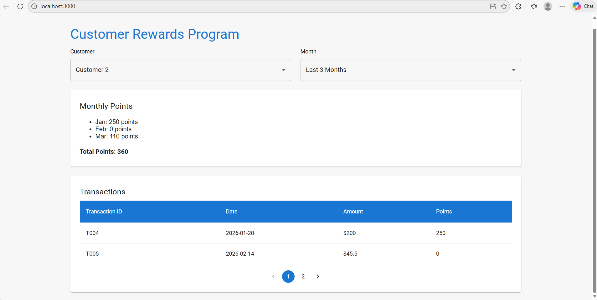

# Customer Rewards App

A React‑based web application that tracks customer transactions and calculates reward points.  
This app demonstrates "reward calculation logic", "monthly summaries", and modern UI features like loader/spinner and pagination .

---

## Features

- Reward Points Calculation
  - > 100 → 2 points per dollar over 100 + 50 points
  - 51–100 → 1 point per dollar over 50
  - ≤ 50 → 0 points
- Customer Selection: Dropdown to choose a customer.
- Month Filter: View transactions for a specific month or last 3 months.
- Monthly & Total Summary: Points breakdown per month plus overall total.
- Transactions Table: Displays transaction ID, date, amount, and points.
- Pagination: Transactions split into pages (configurable page size).
- Loader/Spinner\*\*: Shows while data is being fetched for a smooth experience.

---

## Project Structure

## 📂 Project Structure

rewards-app/
├── public/
│ └── data/
│ └── transactions.json # Customer transaction data (mock API)
├── src/
│ ├── components/
│ │ ├── CustomerRewards.js # Main rewards component
│ │ ├── CustomerDropdown.js # Customer selection dropdown
│ │ ├── MonthDropdown.js # Month filter dropdown
│ │ ├── PointsSummary.js # Monthly & total points summary
│ │ └── TransactionsTable.js # Transactions table with pagination
│ ├── constants/
│ │ └── appConstants.js # Application constants
│ ├── hooks/
│ │ └── useTransactions.js # Custom hook for fetching transactions
│ ├── services/
│ │ └── api.js # API fetch logic with status check
│ ├── styles/
│ │ └── table.css # Table styling
│ ├── test/
│ │ └── rewards.test.js # Unit tests for calculatePoints
│ └── utils/
│ └── rewards.js # Reward calculation logic
├── package.json
└── README.md

---

## UI Screenshot

---

## Unit Tests

Tests passed, including fractional values:

!
[alt text](image-1.png)

---

## Setup

- Install dependencies:
  bash
  npm install
- Install dependencies:
  npm install
- Start the development server:
  npm start
- Open the app at:
  http://localhost:3000

Running Tests
Unit tests are written with Jest and React Testing Library.
Run all tests:
npm test

Run tests once :
npm test -- --watchAll=false

Generate coverage report:
npm test -- --coverage --watchAll=false

View detailed HTML report:
coverage/lcov-report/index.html

Example Test Cases

- Amount > 100 → correct points.
- Amount between 51–100 → correct points.
- Amount ≤ 50 → returns 0.
- Amount = 0 → returns 0.
- Negative amount → returns 0.
- Non‑numeric input → returns 0.
